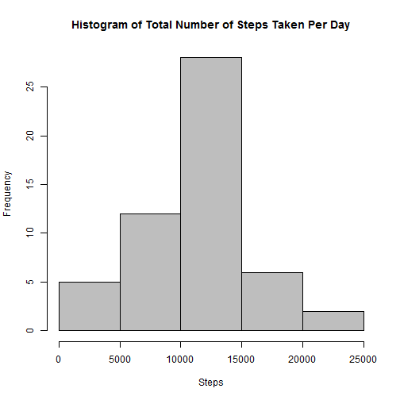
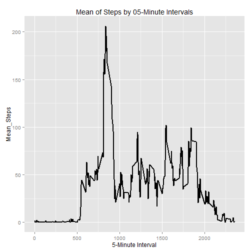
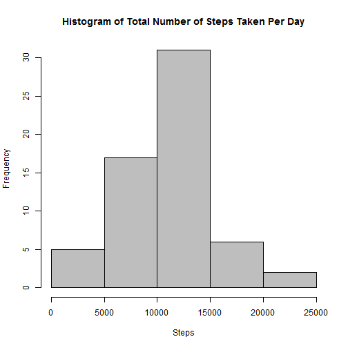
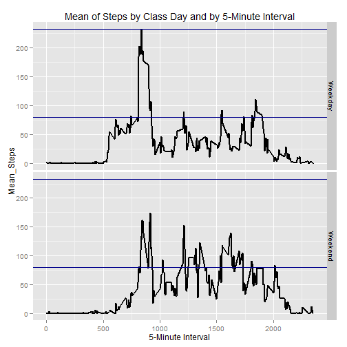

# Reproducible Research: Peer Assessment 1
By gcallao  

The data used for this assessment comes from a personal activity monitor device
which collects data at 5 minute intervals through out the day. The data consists
of two months of data from an anonymous individual collected during the months
of Octobe and November, 2012 and include the number of steps taken in 5 minute
intervals each day.

## Loading and preprocessing the data
First let's set the working directory in the repdata_peearssessment1 folder
cloned and then unzip the activity.zip file.

```r
activity <- read.csv("activity.csv", colClasses = "character")
activity$steps <- as.integer(activity$steps)
activity$date <- as.Date(activity$date, format = "%Y-%m-%d")
activity$interval <- as.integer(activity$interval)
```

## What is mean total number of steps taken per day?
For answering this question first let's summarize the original data by day
ignoring the missing values.

```r
sum_steps_day <- tapply(activity$steps, activity$date, sum, na.rm = TRUE)
sum_steps_day <- data.frame(date = row.names(sum_steps_day), steps_day = sum_steps_day)
sum_steps_day <- subset(sum_steps_day, steps_day != 0)

row.names(sum_steps_day) <- NULL
```

And now create the histogram of the total number of steps taken by day.

```r
hist(sum_steps_day$steps_day, col = "grey",
     main = "Histogram of Total Number of Steps Taken Per Day",
     xlab = "Steps")
```

 

Finally report the mean and median total number of steps taken by day.

```r
data.frame(mean_steps = mean(sum_steps_day$steps), median_steps = median(sum_steps_day$steps))
```

```
##   mean_steps median_steps
## 1      10766        10765
```

## What is the average daily activity pattern?
For answering this question first let's summarize the original data by interval
taking the mean of steps across all days ignoring the missing values.

```r
sum_steps_interval <- tapply(activity$steps, activity$interval, mean, na.rm = TRUE)
sum_steps_interval <- data.frame(interval = as.integer(row.names(sum_steps_interval)), 
                                 steps_inter_mean = sum_steps_interval)
```

And now create the plot requested.

```r
library(ggplot2)
qplot(interval, steps_inter_mean, data = sum_steps_interval, geom = "line",
      main = "Mean of Steps by 05-Minute Intervals", xlab = "5-Minute Interval", 
      ylab = "Mean_Steps" ) + geom_line(size = 0.8) 
```

 

As shown by the plot, the walking activity is higher in the morning than in the
afternoon, and the interval 835 (around 8:30 a.m.) contains the 
maximun number of mean of steps with 206.2 across all days.

```r
max_sstep_interval <- subset(sum_steps_interval, steps_inter_mean == max(sum_steps_interval$steps_inter_mean))
row.names(max_sstep_interval) <- NULL

max_sstep_interval
```

```
##   interval steps_inter_mean
## 1      835            206.2
```

## Imputing missing values
There are a total of 2,304 NAs in the steps variable in the original dataset.

```r
NAs <- !complete.cases(activity)
table(subset(NAs, NAs == TRUE), dnn = "NAs")
```

```
## NAs
## TRUE 
## 2304
```

The strategy for filling in missing values consists in first: order the data set 
by interval, second: take the mean of the next 5 step values and replace the missing
value, and third: if it is still a missing value then take the mean of the previous 5 
steps values in order to replace the missing value.

The last line of the following code chunk contains the final data set with the 
missing values filled in and ordered per days and interval.

```r
#The new data set ordered by interval before the missing value treatment
activity_IMValues <- activity[order(activity$interval), ]

#The strategy for filling missing values
for (i in 1:nrow(activity_IMValues)) {
        if (is.na(activity_IMValues$steps[i]) == TRUE) {
                activity_IMValues$steps[i] <- round(mean(activity_IMValues$steps[i:(i+5)], na.rm = TRUE), 0)
                
                        if (is.na(activity_IMValues$steps[i]) == TRUE) {
                                activity_IMValues$steps[i] <- round(mean(activity_IMValues$steps[i:(i-5)], 
                                                                na.rm = TRUE), 0)        
                }
        }
}

#The new data set with the missing data filled-in and ordered by days and interval
activity_IMValues <- activity_IMValues[order(activity_IMValues$date, activity_IMValues$interval), ]
```

Before making the histogram, let's summarize the new data set by day.

```r
sum_stepsday_IMValues <- tapply(activity_IMValues$steps, activity_IMValues$date, sum)
sum_stepsday_IMValues <- data.frame(date = row.names(sum_stepsday_IMValues), steps_day = sum_stepsday_IMValues)

row.names(sum_stepsday_IMValues) <- NULL
```

Now create the histogram requested and report the mean and median of total number of steps 
taken per day considering the new data set (with missing values filled-in).

```r
hist(sum_stepsday_IMValues$steps_day, col = "grey",
     main = "Histogram of Total Number of Steps Taken Per Day",
     xlab = "Steps")
```

 

```r
data.frame(mean_steps = mean(sum_stepsday_IMValues$steps), median_steps = median(sum_stepsday_IMValues$steps))
```

```
##   mean_steps median_steps
## 1      10627        10461
```

As shown by the comparative data frame the mean and median values using the new data set differ 
from the ones corresponding to the original data set ignoring missing values. 

The impact of imputting missing data is the reduction of the mean and median of total number of steps
taken per day making its distribution MORE RIGHT SKEWED than with the original data set ignoring missing values.

```r
comparative <-  data.frame(measure = c("mean_steps", "median_steps"), MValues = c(mean(sum_steps_day$steps), 
                median(sum_steps_day$steps)), Filled.In.MValues = c(mean(sum_stepsday_IMValues$steps), 
                median(sum_stepsday_IMValues$steps)))

comparative$Variation <- round(comparative$Filled.In.MValues - comparative$MValues, 2)

comparative
```

```
##        measure MValues Filled.In.MValues Variation
## 1   mean_steps   10766             10627    -139.3
## 2 median_steps   10765             10461    -304.0
```

## Are there differences in activity patterns between weekdays and weekends?

First let's create a variable called day to store the names of the days in it, then 
in a factor variable called class_day let's classify the days between weekends or weekdays.

```r
#For setting the language of weekdays
Sys.setlocale("LC_TIME", "English")
```

```
## [1] "English_United States.1252"
```

```r
activity_IMValues$days <- weekdays(activity_IMValues$date)

for (i in 1:nrow(activity_IMValues)){
        if (activity_IMValues$days[i] == "Saturday" | activity_IMValues$days[i] == "Sunday") {
                activity_IMValues$class_day[i] <- "Weekend"
                } else {
                        activity_IMValues$class_day[i] <- "Weekday"       
                }
}
```

Now let's process the data in order to obtain the means of steps by interval and by class_day, and 
then generate the panel plot to make the comparison.

As shown in the plot, there are obvious differences in activity patterns between weekdays and
weekends. The walking activity on weekends tends to be higher in the afternoon as opposed to weekdays with more activity concentrated in the morning around 8:30 a.m.(interval = 835). 

```r
activity_inter.class <- tapply(activity_IMValues$steps, list(activity_IMValues$interval, 
                        activity_IMValues$class_day), mean)

activity_inter.class <- data.frame(activity_inter.class)
interval <- row.names(activity_inter.class)

library(reshape2)
activity_inter.class <- melt(activity_inter.class, id = 0, value.name = "steps")
names(activity_inter.class)[1] <- "class_day"

activity_inter.class <- data.frame(interval = as.integer(rep(interval, times = 2)), activity_inter.class)

library(ggplot2)
qplot(interval, steps, data = activity_inter.class, facets = class_day ~ ., 
        geom = "line", xlab = "5-Minute Interval", ylab = "Mean_Steps",
        main = "Mean of Steps by Class Day and by 5-Minute Interval") + geom_line(size = 0.8) + 
        geom_hline(yintercept = c(max(activity_inter.class$steps), 80), colour ="dark blue")
```

 

